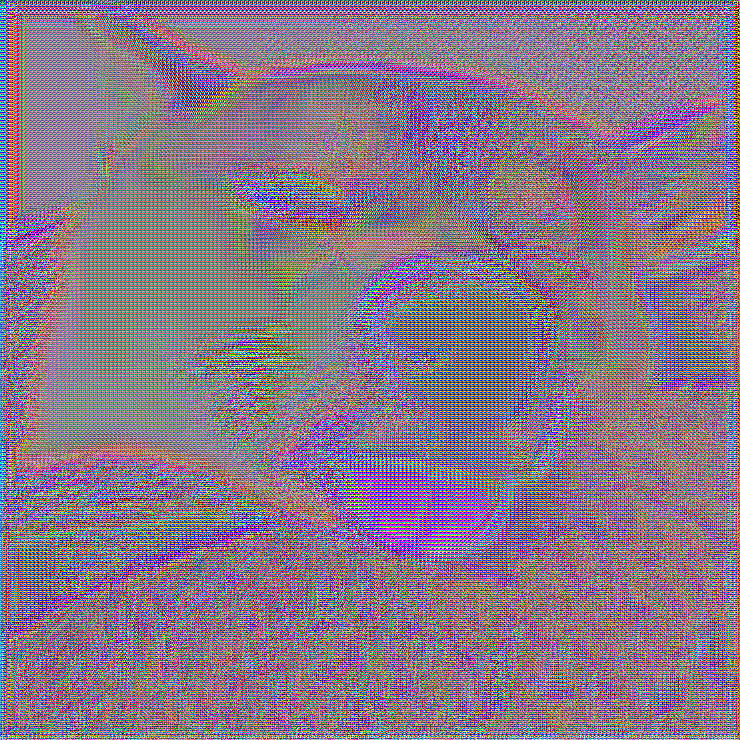

# 🎨 Fast Style Transfer

Transferência de estilo neural em tempo real com TensorFlow.

Inspirado no paper **Perceptual Losses for Real-Time Style Transfer and Super-Resolution** (Johnson et al.).

---

## ✅ Requisitos

- Python **3.10**
- Ambiente virtual recomendado
- TensorFlow **1.15**
- Outras dependências: `numpy`, `scipy`, `imageio`, `pillow`, `moviepy`

---

## ⚙️ Instalação

### 1. Verifique a versão do Python

```bash
py -3.10 --version
````

### 2. Crie e ative o ambiente virtual

```bash
py -3.10 -m venv venv
venv\Scripts\activate   # Windows v1
source venv/Scripts/activate # Windows v2
# ou
source venv/bin/activate  # macOS/Linux
```

### 3. Instale as dependências

```bash
pip install tensorflow==1.15 numpy scipy imageio pillow moviepy
# or
python -m pip install tensorflow numpy scipy imageio pillow moviepy
# or 
pip install -r requirements.txt
```

Ou tudo em uma linha:

```bash
python -m pip install tensorflow==1.15 numpy scipy imageio pillow moviepy
```

Use um datataset de imagens pronto para treinar contem +80k de fotos.

```bash
./setup.sh
```

---

## 📁 Estrutura esperada do projeto

```
fast-style-transfer/
├── style.py
├── evaluate.py
├── checkpoints/
│   └── ghibli_model/
├── styles/
│   └── ghibli.png
├── content/
│   └── dog.jpg
├── results/
│   └── output.png
├── train_data/
│   └── (imagens de treino)
├── src/
│   ├── optimize.py
│   ├── vgg.py
│   ├── transform.py
│   ├── utils.py
│   └── evaluate.py
```

---

## 🚀 Como usar

### 🔧 Etapa 1 — Treinamento

Com apenas o estilo:

```bash
python style.py --checkpoint-dir checkpoints/ghibli_model --style styles/ghibli.png --epochs 1 --batch-size 2
```

Ou com imagens de treino personalizadas:

```bash
python style.py --checkpoint-dir checkpoints/ghibli_model --style styles/ghibli.png --train-path train_data --epochs 1 --batch-size 2
```

---

### 🎨 Etapa 2 — Aplicar o estilo

```bash
python evaluate.py --checkpoint checkpoints/ghibli_model --in-path content/dog.jpg --out-path results/output.png
```

---
## 🖼️ Exemplo: Antes e Depois

| 📷 **Imagem Original**     | 🎨 **Após Transferência de Estilo (Ghibli)** |
| -------------------------- | -------------------------------------------- |
|  |                  |

> A imagem original (à esquerda) é estilizada com a imagem do estilo `ghibli.png`, resultando na imagem à direita.

## 🧠 Notas

* Se ocorrer erro com `scipy.misc`, edite o código e substitua por `imageio` e `Pillow`.
* O projeto foi feito para TensorFlow **1.x** e pode não funcionar corretamente com TensorFlow 2.x ou Python > 3.10.
* Certifique-se de que os arquivos `.py` estejam na pasta `src/` conforme a estrutura acima.

---

## 📄 Licença

MIT — sinta-se livre para usar, estudar e modificar.
